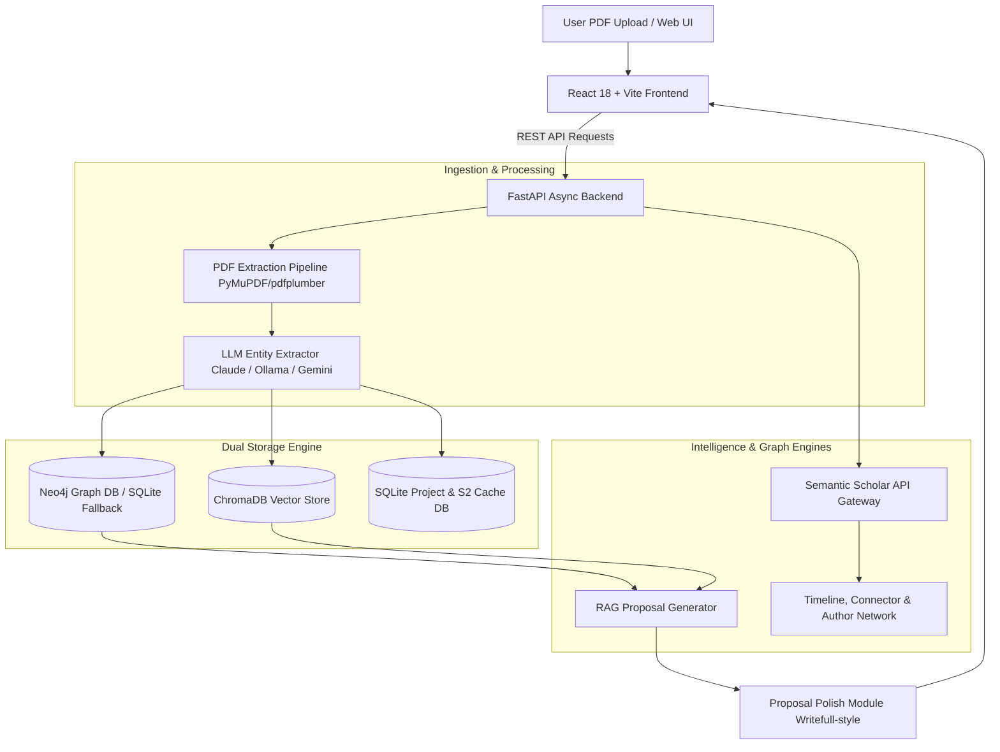

# 🚀 ResearchGap AI — Comprehensive Tech Stack Documentation

ResearchGap AI is an end-to-end AI-powered academic research accelerator designed to ingest scientific literature, construct hybrid knowledge graphs, execute vector RAG (Retrieval-Augmented Generation), detect unexplored research gaps, and produce polished, RAG-grounded research proposals.

---

## 🏛️ High-Level System Architecture



---

## 🛠️ Complete Technology Stack Breakdown

### 1. Frontend Framework & User Interface

| Technology | Version / Tool | Usage & Purpose |
| :--- | :--- | :--- |
| **Framework** | **React 18** | Functional component architecture with hooks (`useState`, `useEffect`, `useMemo`, `useCallback`). |
| **Build Tool & Server** | **Vite v8.1.5** | Lightning-fast HMR (Hot Module Replacement), ES module bundling, and optimized production chunking. |
| **State Management** | **Zustand** | Lightweight central state store (`store.js`) managing active project selection, global health, selected node state, and modal triggers without context boilerplate. |
| **Graph Visualization** | **`react-force-graph-2d`** | 2D HTML5 Canvas-accelerated force-directed graphs for Knowledge Graph visualization and Author Co-authorship networks with zoom/pan and node drag physics. |
| **Styling & Design System** | **TailwindCSS** | Custom dark mode UI theme (`#0a0c14` canvas), glassmorphism styling (`backdrop-blur-xl`, `bg-surface-700/60`), glowing gradients, and custom responsive layouts. |
| **API Client** | **Axios** | Promised-based HTTP client (`client.js`) configured with base URLs, timeout handlers, and unified error handling toasts. |
| **Typography & Icons** | **Inter & Custom SVG Icons** | Modern Google Fonts combined with pixel-perfect vector SVG icons for visual clarity. |

---

### 2. Backend Framework & Microservices

| Technology | Version / Tool | Usage & Purpose |
| :--- | :--- | :--- |
| **Language & Runtime** | **Python 3.13** | Core language powering backend logic, asynchronous tasks, AI models, and database interactions. |
| **Web Framework** | **FastAPI** | High-performance asynchronous REST API framework leveraging OpenAPI/Swagger documentation and ASGI web standards. |
| **ASGI Server** | **Uvicorn** | Asynchronous server gateway interface running FastAPI app instances with multi-process reload capabilities. |
| **Data Validation** | **Pydantic v2** | Strict request/response schema definition and runtime payload validation (`schemas.py`). |
| **HTTP Client** | **HTTPX** | Asynchronous HTTP client with connection pooling, retries, exponential backoff, and semaphore-backed concurrency controls. |
| **Task Execution** | **Python `asyncio`** | Non-blocking execution for parallel database lookups, background PDF indexing, and async external API requests. |

---

### 3. Artificial Intelligence & LLM Ecosystem

| Component | Provider / Framework | Role & Capabilities |
| :--- | :--- | :--- |
| **Primary LLM Engine** | **Anthropic Claude API** (`claude-3-5-sonnet`) | Advanced reasoning engine used for structured PDF entity extraction, research gap discovery, and multi-pass academic proposal generation. |
| **Local LLM Engine** | **Ollama** (`llama3` / `mistral`) | Zero-cost local LLM fallback when cloud API credentials are unavailable or offline operation is required. |
| **Multi-Agent / Hybrid Client** | **Custom Hybrid LLM Client** (`llm_client.py`) | Dynamic fallback manager that routes prompts automatically based on API key availability and latency targets. |
| **Proposal Polish Engine** | **Sub-Pass Post-Processor** | Multi-pass LLM pipeline performing academic tone rewrites (informal ➔ formal register), citation seed verification, and abstract generation. |

---

### 4. Database & Storage Architecture

#### A. Graph Database Engine
- **Primary Engine**: **Neo4j** (Cloud Aura / Self-Hosted) using Cypher query language.
  - **Schema Nodes**: `Paper`, `Method`, `Domain`, `Dataset`, `Metric`, `Author`.
  - **Relationships**: `(:Paper)-[:USES_METHOD]->(:Method)`, `(:Paper)-[:APPLIES_TO_DOMAIN]->(:Domain)`, `(:Paper)-[:EVALUATES_ON]->(:Dataset)`, `(:Author)-[:CO_AUTHORED]->(:Author)`.
- **Automatic Fallback**: **SQLite Graph Engine** (`graph_builder.py`). If Neo4j is offline or unavailable, the system transparently executes relational graph traversal queries without application interruption.

#### B. Vector Database Engine (RAG)
- **Engine**: **ChromaDB** (Persistent Local Storage).
- **Embedding Model**: `sentence-transformers/all-MiniLM-L6-v2` (384-dimensional vector space).
- **Functionality**: Performs semantic similarity vector search across chunked paper text (Abstract, Intro, Methods, Results) to ground RAG proposals in empirical literature evidence.

#### C. Relational & Project Storage
- **Engine**: **SQLite 3** (`data/projects/{project_name}/graph.db`).
- **Isolation**: Multi-tenant workspace architecture keeping raw text extractions, project settings, and external metadata strictly separated per project directory.
- **External Caching Table**: `paper_external_metadata` stores Semantic Scholar citation counts, reference lists, and author profiles with a **30-day TTL**.

---

### 5. PDF Extraction & Processing Pipeline

| Component | Library / Technique | Description |
| :--- | :--- | :--- |
| **PDF Parser** | **PyMuPDF (`fitz`) & `pdfplumber`** | High-precision text extraction preserving document layout, title headers, and section boundaries. |
| **Structure Segmentation** | **Regex & Semantic Heuristics** | Automatically parses raw PDFs into standard academic sections (`Abstract`, `Introduction`, `Methodology`, `Results`, `References`). |
| **Entity Extraction** | **LLM JSON Schema Prompting** | Extracts structured metadata arrays (`methods`, `domains`, `datasets`, `metrics`, `authors`, `year`) from parsed paper sections. |

---

### 6. External Data Integrations

- **Semantic Scholar Graph API** (`api.semanticscholar.org/graph/v1`):
  - **Timeline Scatter Plot**: Pulls verified publication year and real-world citation impact for in-corpus papers.
  - **Literature Connector**: Performs in-memory **Breadth-First Search (BFS) shortest citation path algorithm** up to 3 hops between two selected papers.
  - **Author Network**: Aggregates co-authorship links across corpus papers and fetches an author's top 10 external papers from the Semantic Scholar catalog.

---

### 7. Development & Deployment Tools

- **Package Management**: `npm` (Frontend), `pip` / `venv` (Backend).
- **Environment Management**: `.env` configuration for Gemini API keys, Claude API keys, and Neo4j connection URIs.
- **Testing Suite**: Custom Python verification scripts (`scratch/test_s2_features.py`, `scratch/seed_sqlite.py`).

---

## 📊 Tech Stack Summary Table

```
+-------------------------------------------------------------------------------+
|                             RESEARCHGAP AI STACK                              |
+-------------------------------------------------------------------------------+
|  FRONTEND       | React 18 · Vite 8 · Zustand · TailwindCSS · Force Graph 2D   |
|  BACKEND        | Python 3.13 · FastAPI · Uvicorn · Pydantic v2 · HTTPX       |
|  AI / RAG       | Claude 3.5 Sonnet · Ollama · ChromaDB (all-MiniLM-L6-v2)    |
|  DATABASES      | Neo4j (Cypher) · SQLite (Fallback & Project Isolation)      |
|  EXT. APIS      | Semantic Scholar Graph API (Citations, BFS, Co-Authorship)   |
+-------------------------------------------------------------------------------+
```
